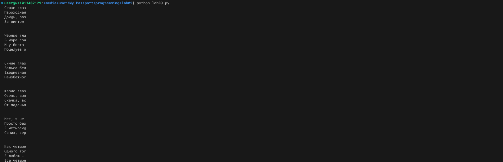

# Лабораторная работа №9
## Сложность: Rare
## Вариант №2
### Задание
1. Решите задачу своего варианта.
2. Оформите отчёт в `README.md`. Отчёт должен содержать:
    - Условия задач
    - Описание проделанной работы
    - Скриншоты результатов
    - Ссылки на используемые материалы
### Ход работы
Генератор для построчного чтения файла. Если длина строки превышает заданный предел - возвращает подстроку допустимого размера.

```python
def read_file(filename, max_length):
    with open(filename, 'r') as file:
        for line in file:
            if len(line) > max_length:
                yield line[:max_length]
            else:
                yield line

filename = 'example.txt'
max_length = 10

for line in read_file(filename, max_length):
    print(line)
```

Результат:

# lab09
